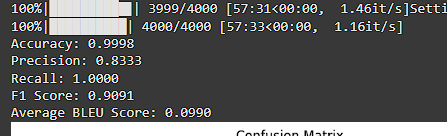
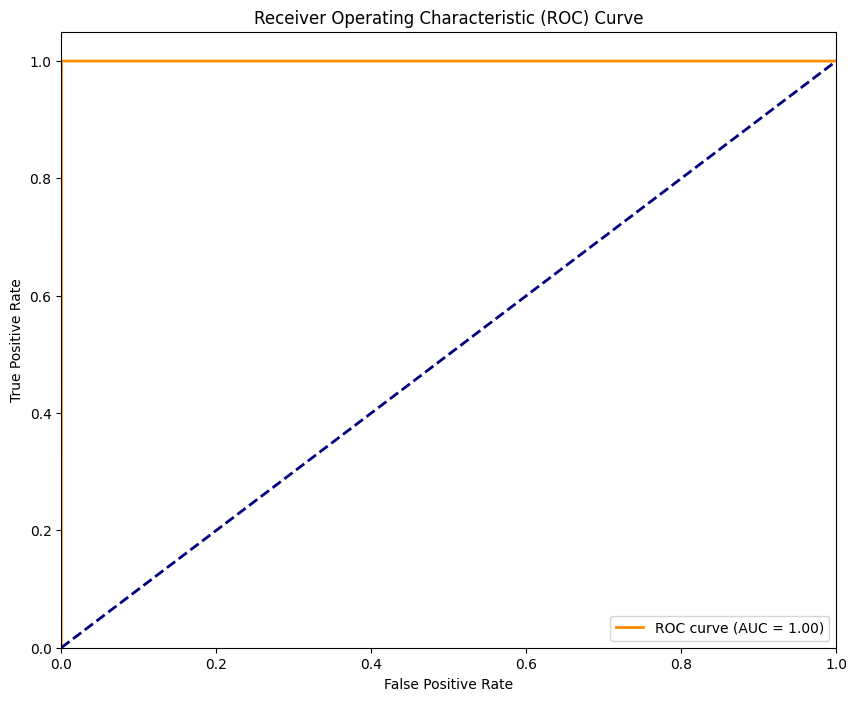
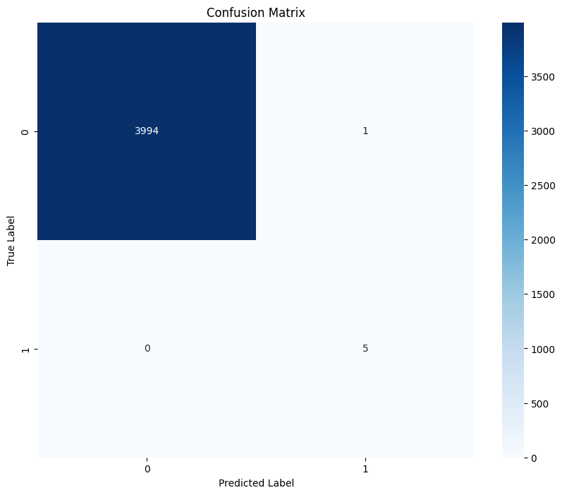
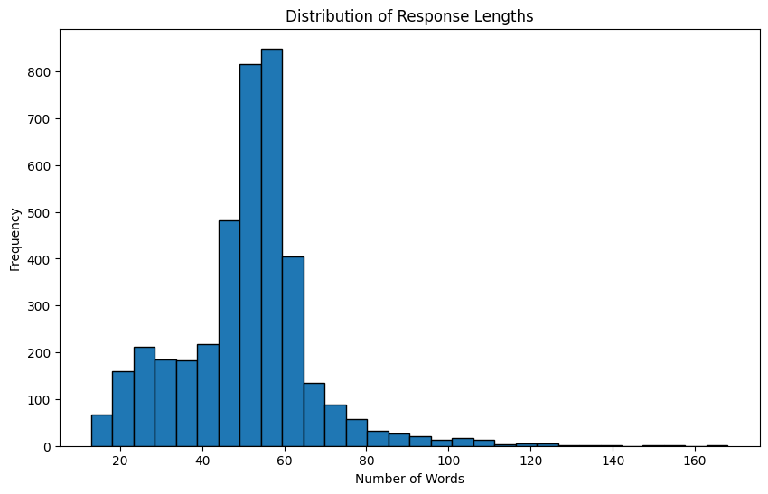

# Documentation

## Members
1. **Mhar Andrei C. Macapallag**
2. Geron Simon Javier
3. Seanrei Ethan Valdeabella

## 1. Introduction

- **Domain:** Computer Science Education
- **Reasoning Method:** Causal Language Modeling
- **Machine Learning Algorithm Chosen:** Transformer-based Neural Network

## 2. Data Preparation

### 2.1. Dataset Description

The dataset is a synthetically generated dataset that contains an input (student queries) and a corresponding output (chatbot responses) tailored for a computer science guidance chatbot. The dataset is specifically designed to provide tailored advice based on the student's knowledge level.

### 2.2. Dataset Generation

For the dataset generation, we first imported the `DataLLM` library and initialized it with an API key. The `DataLLM`'s purpose is to create synthetic datasets based on the descriptions and column configurations.

The `dataset description` is provided to guide the generation of relevant data. The column configurations include the user input, chatbot output, intent, sentiment, and difficulty level. The user input column simulates a student query. The chatbot output column simulates a chatbot's response. The intent column represents the purpose behind the student query. The sentiment captures the emotional tone. Lastly, the difficulty level corresponds to the complexity of the query.

Each column is configured with a prompt, data type, and max tokens. The prompt is a short description that will later guide the data generation for the corresponding column. The data type is self-explanatory. The max tokens is the maximum length for the text generated in the corresponding column. For example, if `user_input_max_tokens` is set to 64, then the generated data is limited to only 64 tokens.

We have also set the number of rows for the dataset which can be customized. It sets how many rows the dataset will generate for each loop.

The dataset is then generated with the `datallm.mock()` function that takes the rows, dataset description, and columns as its arguments. The generated dataset is stored in the `synthetic_data` variable.

### 2.3. Preprocessing Steps

As recently stated, we normalized the texts generated by setting max tokens to control the length of each text. This prevents overly long or irrelevant responses. It also ensures the text is the expected format for training conversational models.

Generating synthetic data may not always end with a complete thought or sentence. That's why we made sure that it does not generate anything that is not complete or incomprehensible. The functions `is_complete_sentence()` and `generate_complete_text()` ensure that the generated data is not incomplete and has complete thought. If it is incomplete, it iteratively appends additional text to the response by re-invoking the `DataLLM` model until either the text is complete or a predefined maximum number of iterations is reached.

```python
def is_complete_sentence(text):
    return bool(re.search(r'(?<!\w\.\w.)(?<![A-Z][a-z]\.)(?<=\.|\!|\?)\s*$', text))

def generate_complete_text(initial_text, prompt, data_description, max_iterations=maximum_iterations):
    complete_text = initial_text
    iterations = 0
    while not is_complete_sentence(complete_text) and iterations < max_iterations:
        try:
            additional_part = datallm.enrich(
                data=pd.DataFrame({'text': [complete_text]}),
                prompt=prompt,
                data_description=data_description,
                dtype=ap_data_type,
                max_tokens=ap_max_tokens,
                progress_bar=False
            )
            additional_text = additional_part.iloc[0]
            complete_text += " " + additional_text
            iterations += 1
        except Exception as e:
            print(f"{tc.red}Error while enriching text: {e}{tc.reset}")
            break
    return complete_text
```

We then cleaned the dataset by reusing `synthetic_data`. We iterated every row of it and used the `generate_complete_text()` to ensure each row has complete text. We then dropped the first generated input and output (`input_part1` and `output_part1`) to reduce clutter in the final dataset. Then we reordered the columns for consistency and to ensure the dataset has a logical structure. The synthetic dataset is now generated and is now taken to the final stage of the preprocessing step.

The final preprocessing step takes the generated synthetic data and undergoes text preprocessing and spelling correction. The `preprocess_text()` function transforms every contraction word to its expanded form. An example is the word "you're" getting expanded to "you are" and "can't" to "can not". The final preprocessing step also involves the removal of URLs, HTML tags, white space, and fixing the spacing around punctuation marks. All of these were done using regex. The `correct_spelling()` function checks if a word is misspelled. First, it tokenizes the text, then it checks if the word is spelled incorrectly, and lastly, it replaces the word with the most likely correct word from the `SpellChecker` dictionary.

```python
def preprocess_text(text):
    # Convert contractions
    text = re.sub(r"n't", " not", text)
    text = re.sub(r"'re", " are", text)
    text = re.sub(r"'s", " is", text)
    text = re.sub(r"'d", " would", text)
    text = re.sub(r"'ll", " will", text)
    text = re.sub(r"'t", " not", text)
    text = re.sub(r"'ve", " have", text)
    text = re.sub(r"'m", " am", text)
    # Remove URLs
    text = re.sub(r'http\S+', '', text)
    # Remove HTML tags
    text = re.sub(r'<.*?>', '', text)
    # Remove redundant whitespaces
    text = re.sub(r'\s+', ' ', text).strip()
    # Fix spacing around punctuation
    text = re.sub(r'\s([,.!?])', r'\1', text)
    return text

def correct_spelling(text):
    words = word_tokenize(text)
    corrected_words = []
    for word in tqdm_notebook(words, desc="Correcting spelling", leave=False):
        corrected_word = spell.correction(word)
        corrected_words.append(corrected_word if corrected_word is not None else word)
    return ' '.join(corrected_words)
```

After applying these preprocessing techniques, the preprocessed dataset is uploaded to our Hugging Face accounts via our Hugging Face token and repository name, ready to use for training the model.

## 3. Model Implementation

### 3.1. Selected Reasoning Technique and ML Algorithm

'Causal Language Modeling' is the main approach for the text generation in the chatbot. This technique allows the model to understand and generate coherent sentences and text based on the previously given words. The main algorithm being utilized is the Transformer-based neural network which is chosen for its self-attention mechanism that makes it possible to recognize more extended dependencies in text. The mechanism of self-attention helps the model to decide on the different weights of the words when creating output which results in a superior understanding of context than the conventional Recurrent Neural Networks (RNN).

### 3.2. Key Sections of the Code

#### 3.2.1. Loading the Base Model and Tokenizer

The `load_base_model` function is responsible for the action that loads the pre-trained model and tokenizer. These components are accessed from the Hugging Face Model Hub using the repository name given.

```python
from transformers import AutoModelForCausalLM, AutoTokenizer

def load_base_model():
    repo_name = "iZELX1/CodePath"  # Repository on Hugging Face
    api = HfApi()
    try:
        model_files = api.list_repo_files(repo_name)
    except Exception as e:
        print(f"Error accessing repository: {e}")
        return None, None
    
    try:
        model = AutoModelForCausalLM.from_pretrained(repo_name)
        tokenizer = AutoTokenizer.from_pretrained(repo_name)
        print(f"Base model and tokenizer loaded successfully from {repo_name}")
        return model, tokenizer
    except Exception as e:
        print(f"Error loading base model: {e}")
        return None, None
```

`AutoModelForCausalLM` and `AutoTokenizer` are used to automatically load the appropriate model and tokenizer based on the repository. This function will ensure that the necessary components will be available to run the chatbot.

#### 3.2.2. Chatbot Class (AdvancedChatbotManager) Initialization

The `AdvancedChatbotManager` class is initialized with the loaded model and tokenizer. The `__init__` method sets up some essential parameters and configurations for the chatbot.

```python
class AdvancedChatbotManager:
    def __init__(self, model, tokenizer, history_file: str = "chat_history.json"):
        self.model = model
        self.tokenizer = tokenizer
        self.model.config.pad_token_id = self.model.config.eos_token_id
        self.history_file = history_file
        self.max_history = 15  # Maximum conversation turns to remember
        self.max_repetition_threshold = 0.7  # Controls response repetition
        self.min_response_length = 15  # Minimum length of response
        self.max_response_length = 150  # Maximum length of response
        self.device = torch.device("cuda" if torch.cuda.is_available() else "cpu")
        self.model.to(self.device)
        self.topic_model = self._initialize_topic_model()
        self.user_feedback = []

    def _initialize_topic_model(self):
        dictionary = corpora.Dictionary([["topic", "model", "initialization"]])
        corpus = [dictionary.doc2bow(["topic", "model", "initialization"])]
        return LdaModel(corpus=corpus, id2word=dictionary, num_topics=5, passes=1)
```

The main parameters that will be set here are `max_history`, `max_repetition_threshold`, `min_response_length`, and `max_response_length`. These will define the behavior of the chatbot. A simple LDA topic model is also initialized for basic conversation analysis.

#### 3.2.3. Response Generation (generate_response)

The `generate_response` function is the core of the chatbot, responsible for generating responses based on user input and conversation history. It uses the model to generate text and applies several checks to ensure the quality of the response.

```python
def generate_response(self, user_input: str, history: List[Dict], max_attempts: int = 5) -> str:
    history_text = self._format_history(history)
    input_text = f"{history_text}\nHuman: {user_input}\nAI:"

    for attempt in range(max_attempts):
        try:
            inputs = self.tokenizer.encode_plus(
                input_text,
                return_tensors="pt",
                padding='max_length',
                max_length=512,
                truncation=True
            ).to(self.device)

            with torch.no_grad():
                outputs = self.model.generate(
                    inputs['input_ids'],
                    attention_mask=inputs['attention_mask'],
                    max_new_tokens=150,
                    num_return_sequences=1,
                    no_repeat_ngram_size=3,
                    top_k=50,
                    top_p=0.92,
                    temperature=self._dynamic_temperature(attempt),
                    do_sample=True
                )

            response = self.tokenizer.decode(outputs[0], skip_special_tokens=True)
            response = response.split("AI:")[-1].strip()

            if (self.check_response_quality(response, user_input) and
                not self.detect_repetition(response, history)):
                return response

        except Exception as e:
            logging.error(f"Error generating response (attempt {attempt+1}): {e}")

    return self._generate_fallback_response(user_input, history)
```

The function formats the conversation history, tokenizes the input, and uses `model.generate` to produce a response. Parameters like `max_new_tokens`, `no_repeat_ngram_size`, `top_k`, `top_p`, and `temperature` control the generation process. The function also includes error handling and a fallback mechanism.

#### 3.2.4. Conversation History Management

These functions handle the loading, saving, formatting, and resetting of the conversation history. The history is stored as a list of dictionaries, with each dictionary representing a turn in the conversation.

```python
def load_chat_history(self) -> List[Dict]:
    try:
        if os.path.exists(self.history_file):
            with open(self.history_file, 'r') as f:
                history = json.load(f)
            if self._validate_history(history):
                return history
    except (json.JSONDecodeError, FileNotFoundError) as e:
        logging.warning(f"Error loading chat history: {e}")
    return []

def save_chat_history(self, history: List[Dict]) -> None:
    try:
        if os.path.exists(self.history_file):
            backup_file = f"{self.history_file}.{datetime.now().strftime('%Y%m%d%H%M%S')}.backup"
            os.replace(self.history_file, backup_file)
        with open(self.history_file, 'w') as f:
            json.dump(history, f, indent=2)
    except Exception as e:
        logging.error(f"Error saving chat history: {e}")

def _format_history(self, history: List[Dict]) -> str:
    formatted = []
    for entry in history[-self.max_history:]:
        formatted.extend([
            f"Human: {entry['human']}",
            f"AI: {entry['ai']}"
        ])
    return "\n".join(formatted)

def reset_history(self) -> List[Dict]:
    return []
```

These functions ensure that the conversation history is properly managed and can be used to provide context for generating responses.

#### 3.2.5. Special Command Handling and Intent Detection

The chatbot can handle special commands and detect user intents. The `handle_special_commands` function processes commands like "reset," "analyze," "help," and "feedback." The `detect_user_intent` function categorizes user input into intents such as "greeting," "question," or "command."

```python
def handle_special_commands(self, user_input: str, history: List[Dict]) -> Tuple[bool, str]:
    if user_input.lower() in ['reset', 'clear']:
        return True, "Conversation history has been reset. How can I help you?"
    elif user_input.lower() in ['analyze', 'stats']:
        analysis = self.analyze_conversation(history)
        return True, f"Conversation Analysis:\n{json.dumps(analysis, indent=2)}"
    elif user_input.lower() in ['help', 'commands']:
        return True, "Available commands: reset/clear, analyze/stats, help/commands, feedback"
    elif user_input.lower() == 'feedback':
        return True, self._get_user_feedback()
    return False, ""

def detect_user_intent(self, user_input: str) -> str:
    intents = {
        "greeting": ["hello", "hi", "hey", "greetings"],
        "farewell": ["bye", "goodbye", "see you", "farewell"],
        "question": ["what", "why", "how", "when", "where", "who"],
        "command": ["do", "please", "can you", "could you"],
        "opinion": ["think", "believe", "feel", "opinion"],
    }
    user_input_lower = user_input.lower()
    for intent, keywords in intents.items():
        if any(keyword in user_input_lower for keyword in keywords):
            return intent
    return "general"
```

These functions enhance the chatbot's ability to interact with users by understanding and responding to specific commands and intents.

## 4. Training the Model

### 4.1. Display Training Code

The training code uses the `Trainer` and `TrainingArguments` classes from the `transformers` library. This code sets up the training parameters and initiates the training process.

```python
from transformers import Trainer, TrainingArguments

training_args = TrainingArguments(
    output_dir=output_directory,
    num_train_epochs=train_epochs,
    per_device_train_batch_size=base_batch_size,
    per_device_eval_batch_size=base_batch_size,
    warmup_steps=warmup_steps,
    weight_decay=weight_decay,
    logging_dir=logging_directory,
    logging_steps=logging_steps,
    evaluation_strategy=evaluation_strategy,
    save_strategy=save_strategy,
    load_best_model_at_end=load_best_model,
    fp16=mixed_precision,
    learning_rate=new_learning_rate,
    gradient_accumulation_steps=gradient_accumulation_steps,
    logging_first_step=lfs,
    save_total_limit=save_checkpoint,
    warmup_ratio=warmup_r,
    adam_epsilon=markdown_e,
    max_grad_norm=grad_clip,
)

trainer = Trainer(
    model=model,
    args=training_args,
    train_dataset=train_dataset,
    eval_dataset=eval_dataset,
    tokenizer=tokenizer,
)
```

trainer.train()
model.save_pretrained(model_name)
tokenizer.save_pretrained(model_name)

### 4.2. Explain Key Parameters

The `TrainingArguments` class sets various hyperparameters for training. These parameters control aspects of the training process such as the number of epochs, batch size, learning rate, and more.

- `output_dir`: Specifies the directory for saving model checkpoints and logs.
- `num_train_epochs`: Sets the number of iterations over the training dataset.
- `per_device_train_batch_size`: Defines the number of training examples per batch on each device.
- `per_device_eval_batch_size`: Similar to `per_device_train_batch_size`, but for evaluation.
- `warmup_steps`: Gradually increases the learning rate during the initial steps.
- `weight_decay`: Applies regularization to prevent overfitting.
- `logging_dir`: Sets the directory for training logs.
- `logging_steps`: Determines the frequency of logging.
- `evaluation_strategy`: Specifies when to perform evaluation (steps or epoch).
- `save_strategy`: Determines when to save model checkpoints (steps or epoch).
- `load_best_model_at_end`: Loads the best model checkpoint at the end of training.
- `fp16`: Enables mixed-precision training for faster performance.
- `learning_rate`: Sets the initial learning rate for the optimizer.
- `gradient_accumulation_steps`: Accumulates gradients over multiple steps before updating.
- `save_total_limit`: Limits the number of saved checkpoints.
- `warmup_ratio`: Specifies the ratio of total steps used for linear warmup.
- `adam_epsilon`: Improves numerical stability in the optimizer.
- `max_grad_norm`: Clips gradients to prevent exploding gradients.

## 5. Testing and Evaluation

The evaluation of the model demonstrates strong performance across several metrics. The model achieved a high accuracy of 0.9998, indicating that it correctly classifies the relationship between inputs and outputs the vast majority of the time.

Similarly, the precision of 0.8333 shows that when the model predicts a relationship between the input and output, it is correct most of the time. The recall is 1.0000, which means that the model correctly identified all instances of the expected relationship. The F1 score of 0.9091, which balances precision and recall, confirms that the model is highly effective. The average BLEU score of 0.0990 suggests that while the model's responses may not be perfect matches to the reference outputs, they are still reasonably similar and relevant.



Additionally, the model shows a high AUC-ROC of 1.00, indicating an excellent ability to distinguish between positive and negative cases.



Further, the token-level accuracy is also very high, and this means that individual words and tokens are very likely to be correct. These metrics, combined with the confusion matrix and response length distribution, demonstrate that the model performs effectively in terms of classification, response generation, and overall understanding. The high performance across multiple metrics indicates that the model is well-suited for its intended tasks, and analysis of the score distribution can inform future improvements.





## 6. Challenges

As we developed and implemented our chatbot, we encountered several significant challenges. Our primary problem was ensuring data quality and diversity. We strived to create a synthetic dataset that accurately represented real-world queries while maintaining a balance across various topics and difficulty levels. Fine-tuning our model required us to carefully optimize hyperparameters, aiming to achieve a proper balance between generalization and specialization. We found that effective context management was crucial yet complex, particularly in maintaining coherence during extended conversations. Accurate intent recognition, especially for ambiguous or multi-faceted queries, demanded that we implement sophisticated natural language understanding capabilities. We persistently worked on generating high-quality responses that avoid repetition and adapt to the user's knowledge level. Ethical considerations were at the forefront of our minds, and we carefully implemented safeguards to prevent the generation of inappropriate content and maintain general integrity. We also focused on scalability and performance optimization to ensure smooth user experiences, even with concurrent users. Lastly, we faced the ongoing challenge of developing a system for continuous learning and updating to keep our chatbot current with evolving computer science knowledge.

## 7. Conclusion

We have successfully developed and implemented an advanced chatbot for computer science based queries, using a Transformer-based neural network with causal language modeling. Our robust evaluation process demonstrated the chatbot's high performance, with impressive accuracy, precision, and recall scores. The implementation of our AdvancedChatbotManager class has resulted in a user-friendly interface with advanced functions for response generation, conversation history management, and special command handling. Initial of our observations suggest that the chatbot effectively stimulates an interactive and engaging learning environment, providing real-time assistance to computer science users/students. We've optimized the system for scalability and implemented ethical safeguards to maintain integrity. While we've achieved our primary objectives, we've identified areas for future improvement, including enhancing data quality and diversity, refining the model's fine-tuning process, and expanding the chatbot's capabilities. As we continue to develop this tool, we anticipate it will play an increasingly important role in computer science field, providing students and users with accessible, accurate, and accurate support in their learning and studies.
